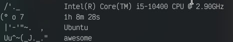
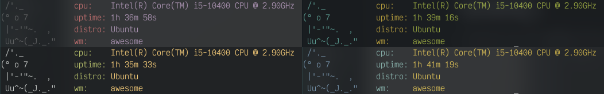

# cat-fetch
A cute, minimal fetch made in C [as my first C program]
Also Victor Mono is the recomened font for the cat art.

# Building
To build, you can  use `clang` (GCC doesnt work, idk why) (make sure you are in the same folder as the file!):
```
clang cat_fetch.c config.c -o cat-fetch
```
after that, you can run catfetch with `cat-fetch` or whatever your compiled binary name was.

# Config

to configure it, use the `catfetch.conf` file, situated in `~/.config/catfetch.conf`.
Here are some examples on how to configure it.

## Colors

these are the colors you can use in the config file
```
default
black
red
green
yellow
blue
magenta
cyan
light_gray
dark_gray
light_red
light_green
light_yellow
light_blue
light_magenta
light_cyan
white
```

### NOTE: YOU SHOULD NOT USE UPPERCASE 

## Parameters

### `primary-color`
Primary color is a parameter that determinates the primary color, aka the color of the icons/text.
#### USE
###### `primary-color=COLOR`
---
### `secondary-color`
Secondary color is a parameter that determinates the secondary color, aka the color of the info (e.g. cpu name, wm name etc.).
#### USE

###### `secondary-color=COLOR`
---
### `cat-color`
Cat color is a parameter that is self explanatory: it determinates the color of the kitty.
#### USE

###### `cat-color=COLOR`
---
### `awesome_icons`
Awesome icons is a parameter that tell the program if it needs to use the FontAwesome Icons instead of text.
> NOTE: [FontAwesome v5+](https://fontawesome.com/) Needs to be installed. \[pro version NOT required]
#### USE

###### `awesome_icons=BOOL`


# TODO

- [x] add color support
- [ ] merge with watts version
- [ ] fix DWM bug
- [ ] Add more cats with a `--random` flag option
